# iot-database2026
2026년IoT개발자 데이터베이스 리포지토리

## 1일차

### 데이터/정보/지식

- `데이터` Data : 단순한 수치나 값
- `정보` Information : 데이터의 의미를 부여한 것
- 지식 Knowlege : 정보를 통한 사물이나 현상에 대한 이해

### 데이터베이스 DataBase

- 조직에 필요한 정보를 위해서 논리적으로 연관된 데이터를 구조적으로 통합, 저장해 놓은 것
- `도메인` Domain - 자기 업무에 관련된 지식
- 기업/기관은 자기 도메인 정보만 저장
- 보통 `CS`(Client - Server) 프로그램이라고 명칭. DB쪽이 서버, 프로그램쪽이 클라이언트

#### 데이터베이스 개념

- 통합 데이터 - `데이터 중복 최소화`, 중복으로 인한 데이터 `불일치 현상 제거`
- 저장 데이터 - 문서가 아닌 `컴퓨터 저장장치에 저장`, 반영구적 저장
- 운영 데이터 - 저장된 상태에서 `업무를 위해 사용`. 검색, 수정 등  
- 공용 데이터 - 여러 사람이 업무를 위해서 `공동으로 사용`

#### 특징

- 실시간 접근성 - 수 초내 결과가 리턴
- 계속적 변화 - 추가, 수정, 조회, 삭제가 가능
- 동시 공유 - 여러 사용자가 동시에 공유.같은 데이터를 사용하더라도 최대한 문제가 없게 처리
- 내용에 따른 참조 - 물리적 저장 데이터가 아닌 데이터값을 참조

#### DBMS

- 데이터베이스를 관리하는 시스템 DataBase Management System의 약자.
- DBMS를 데이터베이스, DB로 통칭

#### DBMS 장점

- `데이터 중복최소화`, 데이터 일관성, 데이터 독립성, 관리기능(백업, 복구, `동시성제어`, 계정, 보안), 개발 생산성, `데이터 무결성 유지`, 데이터 표준 준수...


### 데이터베이스 설치

#### 로컬 설치

1. https://www.mysql.com/ 사이트 다운로드 메뉴
2. MySQL Community Edition 아래 링크 클릭
3. MySQL Installer for Windows 링크 클릭
4. MySQL Installer 8.0.45 , Windows (x86, 32-bit), MSI Installer 500MB 다운 
5. 회원가입이나 로그인 없이 No thanks, just start my download. 클릭
6. mysql-installer-community-8.0.45.0.msi 실행

    

    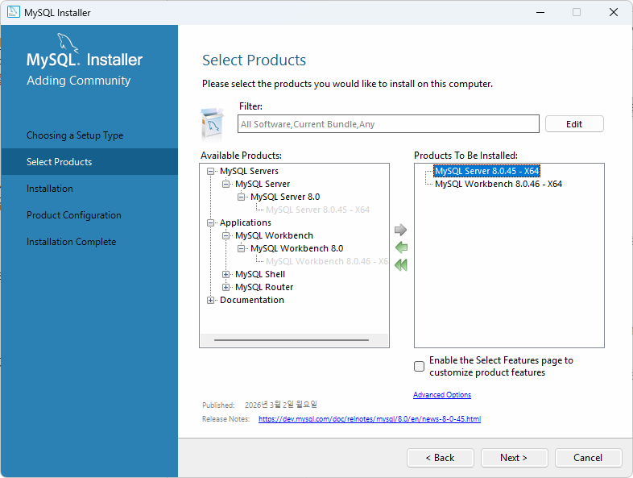

    

7. 일반적인 프로그램 설치와 동일

#### 도커사용 설치

- Docker - 애플리케이션 신속 구축, 테스트, 서비스할 수 있는 `컨테이너 기반의 가상화 플랫폼`
    - 온라인 상에서 이미지를 다운로드(Pull)
    - 실행하는 컨테이너로 만듬(RUN)

1. 도커설치
    - https://www.docker.com/ 사이트 Download Docker Desktop 클릭
    - Docker Desktop Installer.exe 실행
    
     

    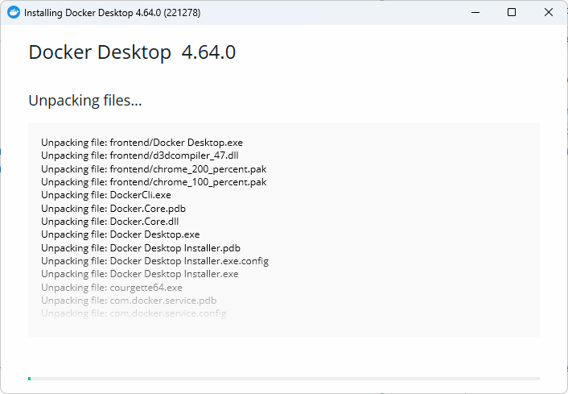

    - close And Restart로 재부팅
    - Docker Subscription Service Agreement 창 Accept 클릭
    - Linux용 Windows 하위 시스템 설치 필수, `wsl --update` 실행

2. 도커 설정
    - 설정 > Start Docker Desktop when you sign in to your computer 체크

3. 도커 콘솔 명령어
    ```powershell
    > docker
    > docker --version
    > docker search 이미지명
    > docker pull 이미지명
    > docker run ...
    ```

3. MySQL 설치
    - Powersehll열기
    - docker search 는 도커허브를 검색 기능

    ```powershell
    >docker search Mysql
    ```

    - docker pull 이미지 다운

    ```powershell
    >docker pull mysql:8.0.45
    ```
    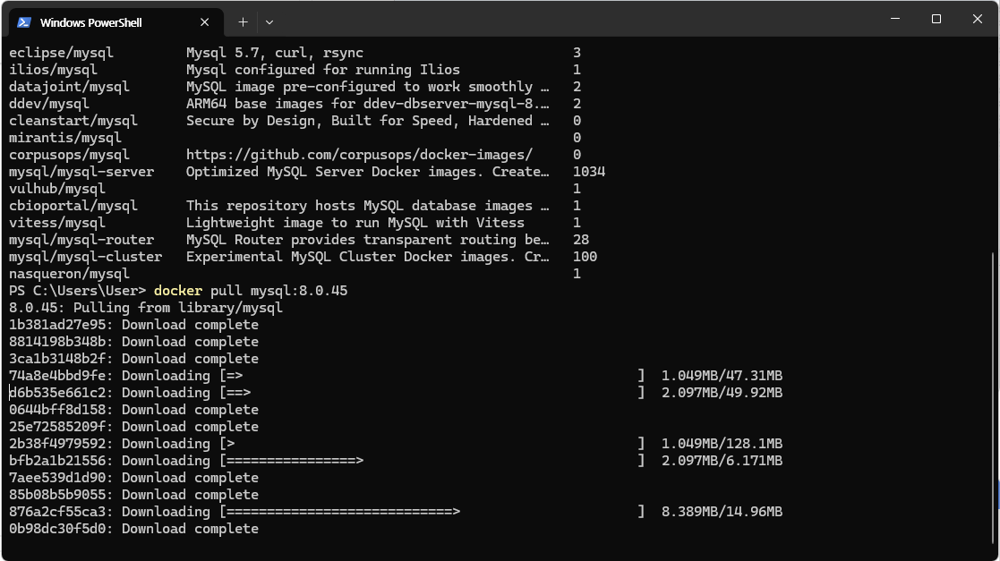
    
    -docker run 컨테이너 실행

    ```powershell
    # \는 윈도우에서 사용불가, 여러줄 명령 불가능. 도커 아이디로도 실행가능
    > docker run -d --name mysql80 -p 3306:3306 -e MYSQL_ROOT_PASSWORD=my123456 -e MYSQL_DATABASE=mydb -e MYSQL_USER=myuser -e MYSQL_PASSWORD=my123456 -v mysql80_data:/var/lib/mysql --restart unless-stopped mysql:8.0.45
    ```

    - 필요 계정
        - root(관리자) - my123456
        - myuser(일반사용자) - my123456

    - 옵션 설명
        - `--name mysql80` : 컨테이너 이름
        - `-p 3306:3306` : 포트번호 컴퓨터에서 접근하는 포트:컨테이너 내부포트
        - `MYSQL_ROOT_PASSWORD` : Mysql 관리자 root 계정비밀번호 초기화
        - `MYSQL_DATABASE` : 컨테이너 시작시 자동 생성할 DB
        - MYSQL_USER / MYSQL_PASSWORD : 일반 사용자 계정
        - -v mysql80_data:/var/lib/Mysql : 컨테이너 내 mysql 데이터 저장위치
        - --restart unless-stopped : 도커 재시작시 자동복구
    
    - docker ps - 현재 실행중인 컨테이너 확인

    - docker exec - 도커 컨테이너 내부 접속

    ```powershell
    > docker exec -it mysql80 mysql -u root -p
    Enter password : 
    ```

5. MySQL Workbench 설치

    - Database 개발툴. MySQL 기본툴
    - 로컬에서 다운로드한 MySQL Installer 8.0.45.exe 실행
    - MySQL Connections 옆 동그라미 + 아이콘 클릭

    

    

6. DBeaver 개발툴 설치

    - https://dbeaver.io/ 다운로드
    - Download EXE 클릭
    - 일반적인 프로그램 설치와 동일

7. Visual Studio Code DB확장 설치

    - 확장 > Database 검색
    - Database Client 설치
    - Database 아이콘 클릭 > `Create Connection` 버튼 클릭

    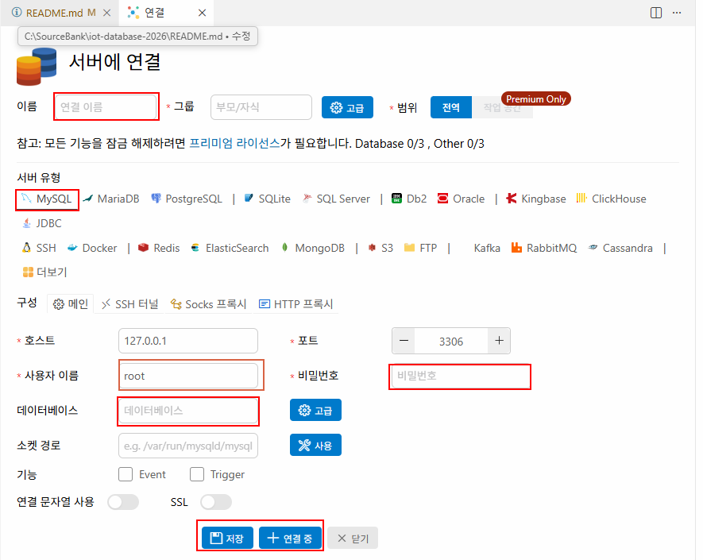

#### MySQL 접속

- 관리자계정 - root
    - 새 사용자 생성, 새 데이터베이스 생성, 권한, 백업 및 복구
- 일반계정 - myuser, madang
    - 해당 데이터베이스에서 데이터 처리 작업


### 기본 이론

#### 관계형 데이터베이스

- Relational Database
    - 1969년 E.F.Codd 수학 모델에 근간해서 고안
    - 테이블을 최소단위로 구성
    - 각 테이블간 관계를 통해서 데이터모델 구성

### 데이터베이스 종류
- `관계형 데이터베이스`
    - Oracle, SQL Server(MS), `MySQL`(Oracle), MariaDB, PostgreSQL(오픈소스)
- NoSQL 데이터베이스
    - MongoDB, Redis, Apache Cassandra, ...
- In-memory 데이터베이스
    - SAP HANA...

#### SQL

-Structured Query Language
    - `구조화된 질의 언어`
    - 데이터베이스에서 데이터를 조작하고, 테이블과 같은 객체를 컨트롤하는 등의 작업을 수행하는 프로그래밍언어

- SQL 종류
    - Data Manipulation Language - 데이터 조작 언어. `SELECT`, `INSERT`, `UPDATE`, `DELETE` 와 같은 데이터를 조작하는 언어.
    - Data Definition Language - 데이터 정의어. CREATE, ALTER, RENAME, DROP 같은 객체(데이터베이스, 테이블, 사용자 뷰, 인덱스,...)를 처리하는 언어.
    - Data Control Language - 데이터 제어어. `GRANT`, `REVOKE` 와 같이 사용자에게 권한주고 해제하는 기능을 처리하는 언어.
    - Transaction Control Language - 트랜잭션 제어어. `START TRANSACTION`, `BEGIN TRAN`, `COMMIT`, `ROLLBACK` 같은 트랜잭션 처리로 동시성 제어를 위한 언어. 

### SELECT 실습

- DBeaver 설정
    - 환경설정 > 편집기 > SQL 편집기 > SQL 포맷
    - keyword case UPPER로 변경

    

- 기본문법

    ```sql
    -- 기본 조회 쿼리, * -> 올이라고 호칭. ALL 키워드와 다름
    SELECT*
        FROM 테이블명;

    -- 컬럼(열) 명시할 때 열 순서를 바꿔서 조회할때
    SELECT 컬럼1, 컬럼2, ... 컬럼n
        FROM 테이블명;

    -- 조건 필터링(필요한 행, 레코드)만 조회할 때
    SELECT *|컬럼명 나열
        FROM 테이블명
        Where 조건...;

    -- 정렬하고 싶을 때
    -- ASCeding(오름차순) | DECending(내림차순)
    -- ASC는 기본이므로 생략 가능
    SELECT *|컬럼명 나열
        FROM 테이블명
        WHERE 조건...
        ORDER BY 컬럼1, 컬럼2, ASC|DESC;
    ```

## 2일차

### 도커 사용하는 이유

- 설치 편의성 - 이미지만 있으면 컨테이너로 실행하는데 수십초에 불과함. 설치설정 불필요
- 환경격차 문제 해결 - OS단의 설정까지 건드려야하는 문제를 없애고, 간단하게 서비스를 실행 가능
- 서버비용 절감 - 새로운 서비스를 할 때마다 하드웨어 서버를 구매, 설정할 필요가 없음
- OS에 독립적 - 새로운 서비스의 운영OS에 따라 OS를 새로 설치할 필요없음
- 가상머신보다 빠름 - VMWare, VirtualBox와 같은 가상OS머신 보다 실행속도가 빠름. 필요없는 기능 제거, 용량 축소

### AI시대 PostgreSQL 학습

- DB시장에서 Oracle. MySQL. SQLServer 다음 PostgreSQL이 4위
- AI시대에 더 비중이 오름
- 나중에 학습할 것


### DBeaver 접속설정 다시

- Public Key Retrieval is not allowed라는 경고메세지로 접속불가할때

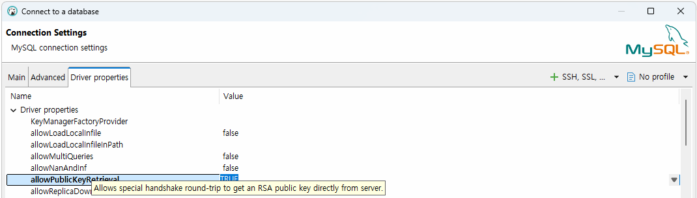

- Driver properties 탭 `allowPublicRetrival` 키를 `true`로 변경

### SELECT 실습

- 기본문법 [쿼리](./day02/1.SELECT기본.sql)

    ```sql
    SELECT ALL|DISTINCT 컬럼1, ...
      FROM 테이블명
    WHERE 필터링조건
    GROUP BY 그루핑컬럼1, 컬럼2...
    HAVING 집계함수필터링조건
    ORDER BY 컬럼1, 컬럼2 DESC;
    ```

#### 필터링

- WHERE 절 - 전체 데이터에서 필요한 것만 필터링

    - 비교 : =(같다), <>(같지 않다), !=(DB종류별로), <, >, <=, >=
    - 범위 : BETWEEN a AND b, 초과, `미만은 사용불가`, `날짜는 조심`할 것!
        - price BETWEEN 10000 AND 20000
    - 집합 : IN, NOT IN
        - price IN (10000, 20000, 25000) -- 가격이 1만, 2만, 2만5천에 속하는 데이터
        - price NOT IN (10000, 20000) -- 가격이 1만, 2만을 제외한 나머지 데이터
    - 패턴 : LIKE (문자열만), %, _
        - bookname LIKE '축구%' -- 책제목중 축구로 시작하는 책 모두
    - NULL : 데이터가 없는 것, 입력되지 않은 것, =로 비교하지 X!
        - price IS NULL, price IS NOT NULL
    - 복합 : AND(C++ &&와 동일), OR(C++ ||), NOT(C++ !)로 비교
        - (price < 20000) AND (bookname LIKE '축구의%')

- ORDER BY - 정렬 ASC(오름차순), DESC(내림차순)

#### 별명

- Alias - 별명으로 컬럼명, 테이블명 등 원래의 이름을 바꿔쓰고 싶을때 AS 사용
    - " 쌍따옴표로 별명을 지정하는 것을 추천. (스페이스사용 등)

#### 그룹화 및 집계함수

- GROUP BY, 집계(통계)함수 - DB를 사용하는 가장큰 목적 중 하나
    - SUM() : 총합, 숫자컬럼만
    - COUNT() : 총 개수, 컬럼 대신 * 가능
    - MIN() : 최소값, 숫자컬럼만
    - MAX() : 최대값, 숫자컬럼만
    - AVG() : 평균값, 숫자컬럼만
    - STD() : 표준편차

- HAVING - 일반 필터링은 WHERE 절로, `집계함수 필터링은 HAVING`절로

- GROUP BY, HAVING 주의사항
    - GROUP BY에 포함되지 않은 컬럼은 SELECT에 사용할 수 없음!
    - 집계함수 외 일반컬럼은 SELECT와 GROUP BY를 일치시킬 것
    - HAVING 절에는 집계함수 필터링 포함
    - WHERE 절에 집계함수 사용불가!
    - SELECT, FROM. WHERE, GROUP BY, HAVING, ORDER BY 순 기억

#### 조인

- JOIN - 관계형 DB의 핵심기능 - [쿼리](./day02/3.JOIN.sql)
    - 두개 이상의 테이블을 합쳐서 하나의 테이블처럼 보여주는 기법

    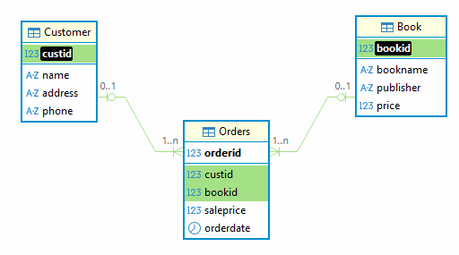

- JOIN 종류 - 종류는 많으나 3가지만 알면 됨
    - INNER JOIN(내부조인) - 조인중에서 가장 간단한 조인. 컬럼이 일치하는 데이터만 조회. 기준테이블 없음. 조인되는 테이블간의 관계 확인
    - OUTER JOIN(외부조인) - 한 테이블 기준으로 데이터가 일치하지 않는 데이터까지 나오도록 조회하는 조인
        - LEFT OUTER JOIN - 두 개의 테이블중 앞쪽 테이블 기준
        - RIGHT OUTER JOIN - 두 개의 테이블중 뒤쪽 테이블 기준

#### 서브쿼리(부솔직의)

- SubQuery - 쿼리 내부에 포함되는 하위쿼리. 항상 소괄호() 내에 작성 - [쿼리](./day02/5.STD연습.sql)
    - 서브쿼리부터 먼저 작성
    - 메인쿼리 - 소괄호 밖의 쿼리
    - 서브쿼리 - 소괄호 안의 쿼리
    - 대부분이 조인으로 변경 가능
    - 조인이 가지고 있는 성능개선의 특징을 사용못하기 때문에 속도저하가 발생할 가능성 높음
    - 조인은 많이 사용한다면, 서브쿼리는 필요할때만 사용

## 3일차

### SELECT 실습

- DB 문자열, 숫자, 날짜시간만 고려하면 됨

#### 서브쿼리 계속

- 서브쿼리 종류 - [쿼리](./day03/1.SUBQUERY.sql)
    - WHERE절 서브쿼리
    - FROM절 서브쿼리
    - SELECT절 서브쿼리

#### 집합연산

- 두 테이블 합치기 - [쿼리](./day03/2.UNION.sql)
    - UNION - 중복제거
    - UNION ALL - 중복표시 합집합

#### GROUP BY 추가 기능

- GROUP BY 컬럼 WITH ROLLUP - 전체 합산 추출 [쿼리](./day03/3.ROLLUP.sql)
    - ROLLUP을 안쓰면 쿼리가 아주 길어짐

### DML 기타

- DML 중에서 직접적인 트랜잭션 영향을 받지 않는 것은 SELECT 뿐

#### INSERT
- [쿼리](./day03/4.DML기타.sql)
- 테이블에 데이터를 삽입하는 쿼리
- 트랜잭션의 영향을 받음

    ```sql
    INSERT INTO 테이블명 (컬럼1, ... 컬럼n)
    VALUES (컬럼1값, ..., 컬럼n값);
    ```

- UPDATE나 DELETE와 달리 큰 문제가 발생하지 않음
- 잘못 입력되면 지우면 됨

#### UPDATE

- 테이블에 존재하는 데이터를 수정하는 쿼리
- 트랜잭션의 영향을 받음
- 수정은 매우 신중

    ```sql
    UPDATE 테이블명
       SET 변경컬럼1 = 변경값1
         , 변경컬럼2 = 변경값2
         , ...
         , 변경컬럼n = 변경값n
     where 구분컬럼 = 구분값;
    ```

#### DELETE

- 테이블에 존재하는 데이터를 삭제하는 쿼리
- 트랜잭션의 영향을 받음
- 삭제는 매우 신중

    ```sql
    DELETE FROM 테이블명
     WHERE 구분컬럼 = 구분값;
    ```


### DDL

- DDL
    - Data Definition Language
    - 객체 생성하고 수정, 삭제하는 기능을 하는 SQL 언어

#### MySQL 데이터타입
- `BOOL` - true / false
- TINYINT, SMALLINT - 1byte(255개), 2byte
     - `TINYINT(1)` - 1/0
- `INT` - 4byte(가장기본)
- `BIGINT` - 8byte
- FLOAT - 4byte 소수점
- DOUBLE - 8byte, 예전에 많이사용
- `DECIMAL(m, n)` - m 전체 65자리수, n 소수점 최대 30 자리수
    - 정수가 35자리, 소수점 30자리인 아주 큰수
    - 현재 가장 많이 사용되는 숫자타입
- DATE - 날짜만 2026-03-17
- `DATETIME` - 날짜와 시간 모두 2026-03-17 16:28:56.092
- CHAR(n) - 고정길이 문자열 n만큼 길이 지정
    - CHAR(10)에 'Hello'입력하면 'Hello     '
    - 나머지 5자리 스페이스로 채움
    - 주민번호, 공통코드처럼 정확한 길이 입력 필요할때
- VARCHAR(n) - 가변길이 문자열 n만큼 길이 지정
    - VARCHAR(10)은 'Hello' 로 저장. 나머지 5자리는 없앰
    - 길이를 넘어서는 문자열은 입력되지 않음(잘림)
    - char, varchar는 길이를 여유있게 설정
- `TEXT`, LONGTEXT - 아주 긴 문자열, 2 ~ 4GB
- `BLOB` - 바이너리로 저장되는 큰 데이터, 2 ~ 4GB


#### CREATE

- DB객체를 생성하는 쿼리 - [쿼리](./day03/5.DDL.sql)
- 데이터베이스, 테이블, 뷰, 인덱스 등 주요 객체를 생성가능

    ```sql
    -- 테이블 생성
    CREATE TABLE 테이블명 (
        컬럼1이름 데이터타입 제약조건,
        컬럼2이름 데이터타입 제약조건,
        ...
        컬럼ㅜ이름 데이터타입 제약조건,
        [각 제약조건 독립적으로 작성]
    );
    -- 데이터베이스 생성
    CREATE DATABASE 데이터베이스명;
    -- 사용자 생성
    CREATE USER 사용자명 IDENTIFIED BY 비번;
    ```

## 4일차

### MySQL 샘플DB

- 샘플DB
    - https://github.com/datacharmer/test_db
    - https://www.mysqltutorial.org/getting-started-with-mysql/mysql-sample-database/
    - https://dev.mysql.com/doc/index-other.html?ref=dbwriter.io

- `Sakila`(영화 대여DB) - [쿼리](./ref/sakila-schema-safe.sql)
    - Data - [쿼리](./ref/sakila-data.sql)
- INSERT INTO 대량 삽입

### DML 추가

- INSERT INTO 대량 삽입 - MySQL 방법 - [쿼리](./day04/1.INSERT추가.sql)

    ```sql
    INSERT INTO 테이블명 VALUES (컬럼1값, 컬럼2값, ... 컬럼n값),
    (컬럼1값, 컬럼2값, ... 컬럼n값),
    (컬럼1값, 컬럼2값, ... 컬럼n값),
    ...
    (컬럼1값, 컬럼2값, ... 컬럼n값);
    ```

- SELECT TOP 3
    - 전체 조회 수중에서 조건에 맞는 데이터 3개만 조회

### DDL 계속

#### 제약조건 개요

- 데이터베이스에 정확한 데이터가 들어갈 수 있도록, 각 컬럼별 입력가능한 데이터를 지정하는것
- 무결성을 벗어나는 데이터는 못들어가도록 제약을 주는 것
- 종류 : 기본키`(Primary Key)`, 단일(Unique), 널허용 여부(Null), 체크(Check), 기본값(Default), `외래키(Foreign Key)`

#### CREATE 계속

- CREATE 구문 - [쿼리](./day04/2.CREATE.sql)
    - PRIMARY KEY (컬럼1 또는 여러개)
    - FOREIGN KEY (custid) REFERENCES NewCustomer(custid) ON DELETE CASCADE,
        - REFERENCES : 참조하는 부모테이블과 PK컬럼
        - ON DELETE CASCADE : 무결성 유지를 위해서 부모테이블의 해당 PK데이터를 삭제하면 자식테이블 관련
        FK데이터도 같이 삭제하는 옵션
        - ON DELETE SET NULL : 부모테이블의 PK값이 삭제되면, 자식테이블의 FK값은 NULL로 변경한다
        - ON UPDATE CASCADE | SET NULL : 수정할 때도 삭제시와 유사한 처리 가능. 수정도 가능하지만 PK 수정이 거의 없기 때문에 많이 사용되지 않음

- AUTO_INCREMENT : 테이블에 데이터 삽입할때 숫자타입 PK의 값을 자동 증가시켜서 만들어주는 기능
    - PK 컬럼은 INSERT 문에서 생략

#### ALTER

- ALTER - - [쿼리](./day04/3.ALTER.sql)
    - 객체 수정. 테이블 외에서는 많이 사용안됨

    ```sql
    ALTER TABLE 테이블명
        [ADD 속성명 데이터타입]
        [DROP COLUMN 속성명]
        [MODIFY 속성명 데이터타입]
        [MODIFY 속성명 [NULL|NOT NULL]]
        [ADD PRIMARY KEY(컬럼명)]
        [[ADD|DROP] 제약조건명]
    ```

#### DROP

- DROP
    - 객체 삭제
    - 테이블에서는 관계를 맺고 있는 자식테이블 먼저 삭제 후 부모테이블 삭제 가능

    ```sql
    DROP 객체 객체명
    ```

### 내장함수

- C, C++ 내장함수와 동일 - - [쿼리](./day04/4.내장함수.sql)

### NULL 과 NULL관련 함수

- 아직 지정되지 않은 값. - [쿼리](./day04/5.NULL.sql)
- '0', '', ' ' 과 다름
- C, c++ '\0' 과 동일한 의미
- 비교연산 불가(=, >, <, >=, <=,!=) 대신 IS, IS NOT만 사용 가능
- NULL 값을 연산하면 결과도 NULL이 됨
    - NULL + 숫자 => NULL
    - 집계함수 계산 시 NULL 포함된 행은 집계에서 빠짐(!)


### 쿼리연습

- [쿼리](./day04/7.Sakila_practice.sql)

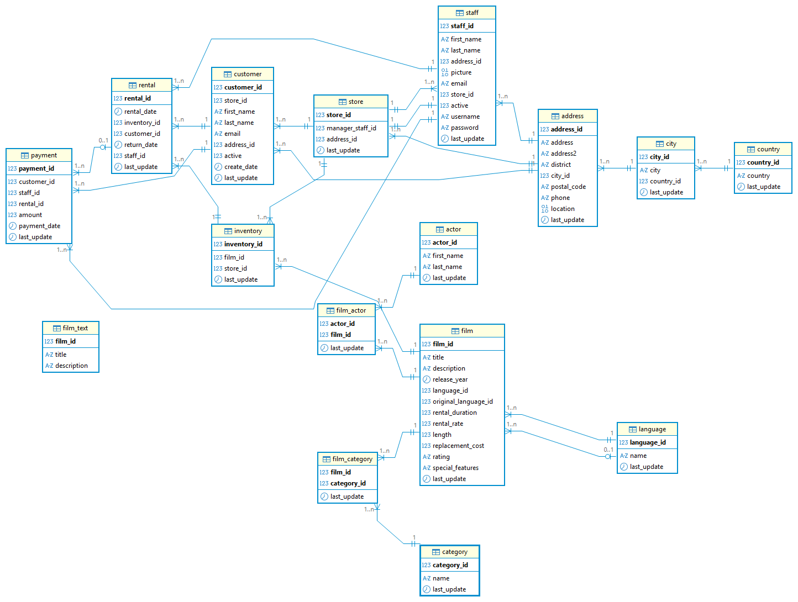

### 뷰

### 인덱스

### 트랜잭션, 동시성제어

- TCL

### 보안 및 관리

#### 사용자

- DDL 일부

#### 권한

- DCL

### MySQL 프로그래밍

### 데이터베이스 모델링


## 6일차

- 생성
    - DBeaver 해당 DB Procedure 폴더에서 마우스 오른쪽 버튼 > Create New Procedure
    - Name, 필요한 함수명 입력
    - Type, FUNCTION 선택

    

    - 작성 후 Save 클릭(Execute)

## 7일차

### MySQL 프로그래밍

#### 저장 프로시저 - [쿼리1](./day07/1.PROCEDURE_원본.sql). [쿼리2](./day07/1.PROCEDURE_실행.sql)

- 저장 프로시저
    - 함수와 달리 리턴값이 없음, 단 OUT 파라미터로 결과를 돌려받을 순 있음(리턴과 유사)
    - 일반 쿼리문에 포함해서 실행 불가
    - 단독 실행 또는 스케줄에 따라 배치 실행 시
    - 사용자 없는 새벽에 `대량처리` 수행할 때

- 생성
    - DBeaver 해당 DB Procedure 폴더에서 마우스 오른쪽 버튼 > Create New Procedure
    - Name, 필요한 프로시저명 입력
    - Type, Procedure 선택
    - 작성 후 Save 클릭(Execute)

#### 커서

- Cursor - 저장 프로시저 쿼리 참조
    - 마우스 커서와 동일하게 테이블의 한 위치를 가리키는 객체
    - 테이블의 데이터를 한 행씩 처리하기 위해서 사용
    - CURSOR, OPEN, FETCH, CLOSE
    - 일반 프로그래밍 언어와 연동시 사용

#### 트리거

- Trigger - [쿼리1](./day07/2.TRIGGER_원형.sql), [쿼리2](./day07/2.TRIGGER.sql)
    - 방아쇠를 뜻함. 하나의 테이블에서 INSERT, UPDATE, DELETE 문이 실행되면 다른 테이블이나 다른 처리가
    자동으로 실행되는 저장 프로그램 중 하나
    - Before Trigger보다 After Trigger가 많이 사용
    - 시스템 로그 기능에 많이 사용됨

    

#### Visual Studio 프로젝트 속성

- 프로젝트 속성(부모 기본값 상속 체크 반드시)
    - C/C++ > 일반 > 추가 포함 디렉토리
        - C:\Program Files\MySQL\MySQL Connector C++ 9.6\include 추가
    - 링커 > 일반 > 추가 라이브러리 디렉토리
        - C:\Program Files\MySQL\MySQL Connector C++ 9.6\lib64\vs14 추가
    - 링커 > 입력 > 추가 종속성
        - mysqlcppconn.lib

#### 텔넷 클라이언트 설정

- 시작 > appwiz.cpl 실행
    - Windows 기능 켜기/끄기 클릭
    - Telnet Client 체크 활성화
    - powershell이나 콘솔

### 데이터베이스 모델링

#### 모델링

- 개요
    - 현실세계에 존재하는 시스템을 컴퓨터 시스템으로 변환하기 위해 디자인
    - 현실세계의 데이터를 DB상에 입력해서 프로그램에서 사용할 수 있도록 설계
    - 현실세계 데이터와 DB상 데이터가 일치
    - 예. 오프라인 매장 -> 온라인 매장, 시립 도서관 -> 온라인 시립 도서관, 백화점 -> 모바일 백화점 

- 데이터베이스 생명주기
    - `요구사항 수집 및 분석` > `설계` > `구현` > 운영 > 감시 및 개선

- SW 생명주기
    - DB 생명주기 설계와 구현이 SW생명주기 설계에 속함
    - `요구사항 수집 및 분석` > `설계` > 구현 > 테스트 > 베포 > 유지보수/관리

- DB 설계의 순서
    1. 개념 모델링 : 요구사항에 따른 개념적인 모델링으로, 추상적인 도형으로 관계 구성
        - 전체적인 뼈대를 만드는 과정
        - 각 테이블이 될 `엔티티` 추출
        - 테이블의 컬럼이 될 속성 추출
        - 속성 구분자가 될 키 추출
    2. `논리 모델링` : 개념 모델링을 바탕으로 속성, 키, 관계 명확히 정의
        - 개념 모델링에서 나오지 않았던 상세 속성들을 추출, PK, FK...
        - 데이터 중복을 최소화하는 `정규화` 수행
        - 관계형 데이터모델 테이블화, 구체화
    3. `물리 모델링`
        - 실제 DB 종류(Oracle, `MySQL`, SQL Server)를 고려해서 설계
        - 테이블, 컬럼, 인덱스, 제약조건, 뷰 등 객체 및 PK, FK, NULL 등 제약조건 생성
        - 성능을 위해 정규화된 내용을 `반정규화` 진행
        - 최종 스키마 완성
        - 실제 데이터베이스화(내보내기 기능)
    
## 8일차

### 데이터베이스 모델링

#### ERD

- Entity Relationship Diagram
    - 개체 관계 다이어그램 : 관계형 DB에 사용된 테이블의 상호관계를 그림으로 구조화
    - 세상의 사물을 개체(Entity)와 개체 간의 관계(Relationship)으로 표현

- ERD 모델링 툴
    - ERWin Data Modler : 퀘스트 사에서 만든 대표적인 ERD 작성툴. 업계표준. 유료
    - eXERD : 한국산 모델링툴, 이클립스 기반
    - ER/Studio : 대규모 엔터프라이즈 데이터 모델링툴. 유료
    - Draw.io - https://app.diagrams.net/. 개념/논리 ERD 작성 가능. 무료
    - `erdcloud` - https://www.erdcloud.com/ 한국에서 개발한 웹기반 모델링툴. 논리/물리 ERD 작성, 내보내기 기능, 무료/유료
    - DBeaver - 물리 ERD 뷰어 제공. 모델링 불가
    - MySQL Workbench - DBMS관리툴. 물리 ERD 작성 가능. MySQL DB 생성 장점

#### ER모델

- 개체(Entity)
    - 사람, 사물, 장소, 개념, 사건 등 유무형의 정보를 가진 독립적 실체
    - 명사로 표현, 개체는 여러개의 속성으로 표현
    - 직사각형, 이중 직사각형(다른 개체와 연관되는 개체) 등으로 표현

    

- 속성(Attribute)
    - 개체가 가지는 성질
    - 일반 속성(타원), 키 속성(글자에 밑줄), 다중속성(이중타원), 유도속성(점선타원), ...

    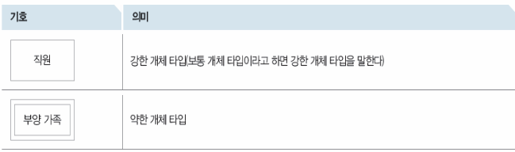

- 관계(Relationship)
    - 개체간의 연관성 나타내는 개념
    - 마름모로 표시
    - 관계 대응수 표시, 1:1(사원:컴퓨터), 1:n(고객:도서구매), n:1(학생:학과), `n:m(학생:강좌)`
    - 다대다(n:m) 관계는 물리적 모델링시 반드시 (n:1, 1:m)으로 분리해야 함

    

- 여기까지 개념 ER모델이지만, 현재는 논리 ER모델과 통합해서 작성하고 있음. IE표기법

    

#### ERD 설계 + 정규화 실습

- 학원 수강관리 시스템
    - 학생의 학원에서의 해당 강사에게 속한 과목을 수강신청 하는 시스템 설계 DB

- 요구사항 분석
    - 학생정보, 강사정보, 과목정보, 수강신청정보
    - 학생은 여러 과목을 수강할 수 있음
    - 한 과목은 한 명의 강사가 담당함
    - 학생의 수강 신청일과 성적도 관리함

- 학원 엑셀에서 관리하는 정보 -> DB시스템화

| 학번   | 학생명 | 전화번호          | 과목코드 | 과목명    | 강사명 | 강사전화          | 신청일        | 성적 |
| ---- | --- | ------------- | ---- | ------ | --- | ------------- | ---------- | -- |
| 1001 | 김철수 | 010-1111-1111 | C101 | C언어    | 이민호 | 010-9999-1111 | 2026-03-01 | A  |
| 1001 | 김철수 | 010-1111-1111 | P201 | Python | 박지은 | 010-9999-2222 | 2026-03-02 | B  |
| 1002 | 이영희 | 010-2222-2222, 010-3333-3333 | P201 | Python | 박지은 | 010-9999-2222 | 2026-03-03 | A  |

- 수강관리 시스템화 되기 이전 문제점
    - 이상현상
        - 삽입 이상 : 수강생이 없는 새 과목은 추가가 어렵다(과목, 강사명, 강사전화 만 입력해서 의미있는 데이터가 아님)
        - 수정 이상 : 박지은 강사의 전화번호가 바뀌면 Python 과목을 듣는 모든 행을 찾아서 수정필요
        - 삭제 이상 : 특정 학생의 과목신청 내용을 삭제하면, 과목정보, 강사정보 모두 사라질 수 있음

- 정규화
    - 이상현상, 종속성문제, 이행성 문제 등을 제거하는 작업

- **제1정규형**(1NF)
    - `도메인(속성값)이 원자`값이어야 함. 한 컬럼에 여러값이 들어가면 안됨
    - 전화번호 컬럼에 010-2222-2222, 010-3333-3333 두 개의 값이 들어가면 안됨

    학생정보 원자화 -> 학번(PK) 중복
    | 학번 | 학생명 | 전화번호 |
    | ---- | --- | ----------- |
    | 1002 | 이영희 | 010-2222-2222 |
    | 1002 | 이영희 | 010-3333-3333 |

- **제2정규형**(2NF)
    - 기본키의 일부에만 종속되는 컬럼은 제거함. `부분적 (함수) 종속 제거`
    - 학생명, 전화번호 속성은 학번에만 종속 -> 학생 정보 분리
    - 과목명, 강사명, 강사전화는 과목코드에만 종속 -> 강사정보, 과목정보
    - 신청일, 성적은 (학번, 과목코드) 속성에 포함

    학생정보 종속성 분리
    | 학번 | 학생명 | 전화번호 |
    | ---- | --- | ----------- |
    | 1001 | 김철수 | 010-1111-1111 |
    | 1002 | 이영희 | 010-2222-2222 |
    | 1002 | 이영희 | 010-3333-3333 |

    과목/강사정보 종속성 분리
    | 과목코드 | 과목명 | 강사명 | 강사전화 |
    | ----- | --- | ---- | -------- |
    | C101 | C언어 | 이민호 | 010-9999-1111 |
    | P201 | Python | 박지은 | 010-9999-2222 |

    수강신청정보 종속성 분리
    | 학번 | 과목코드 | 신청일 | 성적 |
    | ---- | ----- | --------- | -- |
    | 1001 | C101 | 2026-03-01 | A |
    | 1001 | P201 | 2026-03-02 | B |
    | 1002 | P201 | 2026-03-03 | A |

- 일반적 3정규형까지 완ㄹ하고 ERD를 작성. 2정규형 결과까지만 ERD 작성도 수행가능

- **제3정규형**(3NF)
    - 이행적 종속성 : A -> B, B -> C 면 A -> C
    - 과목/강사정보 : 과목코드 -> 과목명, `과목코드 -> 강사명, 강사명 -> 강사전화`
    - 과목코드 -> 강사명 -> 강사전화, 과목정보가 강사정보를 끌고 다님
    - 과목코드로 강사전화를 알 필요가 없음
    - 과목정보, 강사정보로 분리, `이행적 (함수) 종속성 제거`해야 함
    - 강사정보를 구분지을 수 있는 키속성이 생성되어야 함

    학생정보(Student)
    | 학번(PK) | 학생명 | 전화번호 |
    | ---- | ---- | ---- |
    
    과목정보(Lecture)
    | 과목코드(PK) | 과목명 | 강사번호 |
    | ---- | ---- | ---- |

    강사정보(Instructor)
    | 강사번호(PK) | 강사명 | 강사전화 |
    | ---- | ---- | ---- |

    수강정보(Enrollment)
    | 학번(FK/PK) | 과목코드(FK/PK) | 신청일 | 성적 |
    | ---- | ---- | ---- | ---- |

- 3정규형 적용한 개념ERD

    

- 논리ERD 작성
    - 각 컬럼에 데이터형식 지정
    - 도메인에 들어갈 데이터 특정

    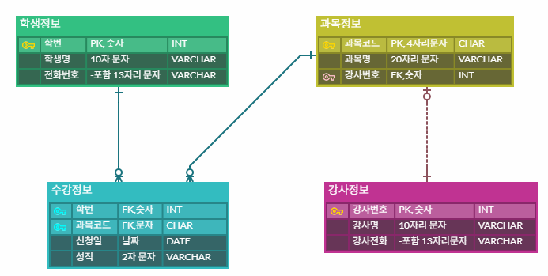

- 물리ERD 작성
    - DB종류에 따른 데이터타입 특정
    - 관련 뷰, 인덱스 등 추가 객체 처리(ERDCloud에서는 불가능)

    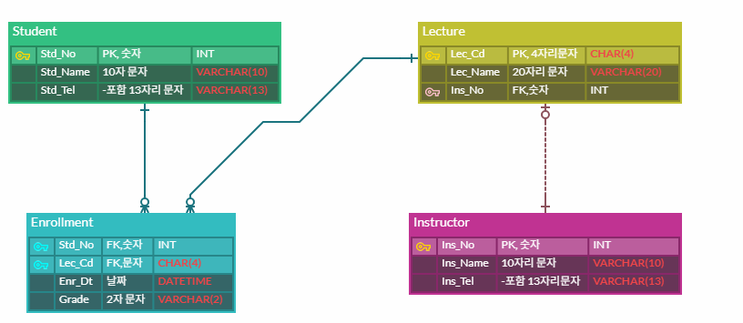

- MySQL 데이터베이스화
    - ERDClude 내보내기 버튼

    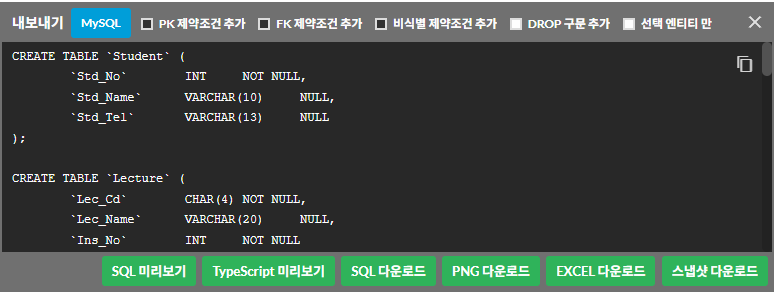

    - MySQL 데이터베이스, 사용자 직접 생성
    - 학원이름(부경 IT아카데미, PKIT Academy)
    - 학원 수강신청 시스템(Institude Enrollment System) -> PA-IES -> PAIES DB명 선정

    ```sql
    -- PAIES DB생성
    CREATE DATABASE PAIES;

    -- 사용자 생성
    CREATE USER ies_user IDENTIFIED BY 'my123456';
    CREATE USER 'ies_user'@'%' IDENTIFIED BY 'my123456';


    -- 권한
    GRANT ALL PRIVILEGES ON PAIES.* TO 'ies_user'@'%';
    -- 권한 바로 적용
    FLUSH PRIVILEGES;
    ```

    - NULL과 NOT NULL 비교

    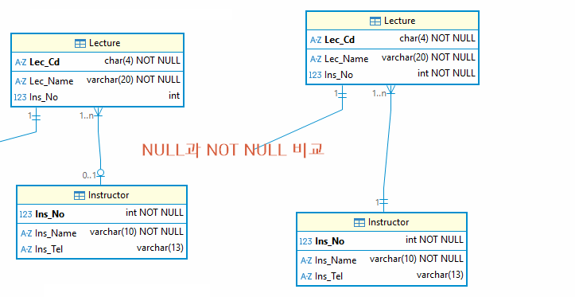

    - 강사정보(Lecture) 테이블 Ins_No 가 NULL과 NOT NULL 사이의 관계 비교
    - 왼쪽은 강사번호 없어도 입력 가능, 오른쪽은 강사번호 입력 필수

- **BCNF(Boyce-Codd 정규형)**
    - 모든 함수 종속 X -> Y에서 X는 반드시 `유일한 결정자`가 되어야 함
    - 키 종류 : 기본키, 외래키, 복합키(두 개의 속성이 기본키 구성), 후보키, 슈퍼키
    - 후보키 : 슈퍼키(기본키)가 될 수 있는 속성들
    - 슈퍼키 : 행을 유일하게 식별할 수 있는 속성 집합(한 개 또는 여러개). 유일하기만 하면 됨

    | 학생 | 과목 | 강사 |
    | -- | --- | --- |
    | A | C언어 | 김교수 |
    | B | C언어 | 김교수 |
    | A | DB | 이교수 |

    - (학생, 과목) -> 강사 결정가능
    - 과목만 가지고도 강사를 결정가능. 학생은 강사 지정할 키가 아님

    과목-강사 분해
    | 과목 | 강사 |
    | --- | --- |
    | C언어 | 김교수 |
    | C언어 | 김교수 |
    | DB | 이교수 |

    학생-과목 분행
    | 학생 | 과목 |
    | -- | --- |
    | A | C언어 |
    | B | C언어 |
    | A | DB |

    - 결정자는 무조건 키여야 함!

- **제 4정규형**(4NF)
    - `다중값 종속 제거`
    - 처음부터 설계 잘못된 부분이 대부분. ERD 작성시 발생경우 거의 없음

    | 학생 | 취미 | 자격증 |
    | -- | -- | ------ |
    | A | 축구 | 정보처리기사 |
    | A | 축구 | SQLD |
    | A | 독서 | 정보처리기사 |
    | A | 독서 | SQLD |

    취미정보 분해
    | 학생 | 취미 |
    | -- | -- |
    | A | 축구 |
    | A | 축구 |
    | A | 독서 |
    | A | 독서 |

    자격증정보 분해
    | 학생 | 자격증 |
    | -- | ------ |
    | A | 정보처리기사 |
    | A | SQLD |
    | A | 정보처리기사 |
    | A | SQLD |

- **제 5정규형**(5NF)
    - `조인 종속 제거`
    - 설계로 테이블 나눠도 조인을 하면 원래 데이터 나와야 함
    - 엑셀 내용과 DB화 한 테이블 조인 후 결과가 동일함

- 요약

    | 단계 | 핵심 |
    | ---- | ---- |
    | 1NF | 다중값(`도`메인) 제거 |
    | 2NF | `부`분 종속 제거 |
    | 3NF | `이`행 종속 제거 |
    | BCNF | `결`정자 이상 제거 |
    | 4NF | `다`중값 종속 제거 |
    | 5NF | `조`인 종속 제거 |

    - 정규화를 모두 진행한 뒤 DB화를 진행
    - 단, 쿼리 실행 시 속도저하 발생 가능 -> 반정규화

### 대량 데이터 인덱스 실습

- 100만건 이상의 데이터에서 인덱스를 제대로 설정하지 않으면 조회 쿼리시 속도 저하
- 1차적으로 인덱스 거는 작업. 2차적으로 쿼리 튜닝

#### 초기설정

- 대량데이터 실습용 테이블 생성 orders_big - [쿼리](/day08/3.대량데이터_인덱스_실습.sql)
- 순번 처리용 테이블 nums
- 100만건씩 insert용 저장프로시저 insert_big_orders - [쿼리](/day08/4.대량데이터_저장프로시저.sql)
- 저장프로시저 실행 - [쿼리](/day08/5.저장프로시저_실행.sql)

#### 인덱스 연습

- 실행계획 확인(Execution Plan) 확인 - [쿼리](/day08/6.인덱스_실습쿼리.sql)
    - DB 쿼리 최적화 분석 방법

- 실행계획 결과 

```text
-> Sort: orders_big.order_date DESC  (cost=1.04e+6 rows=9.95e+6) (actual time=2605..2605 rows=26 loops=1)
    -> Filter: (orders_big.customer_id = 123456)  (cost=1.04e+6 rows=9.95e+6) (actual time=1138..2604 rows=26 loops=1)
        -> Table scan on orders_big  (cost=1.04e+6 rows=9.95e+6) (actual time=0.0978..2309 rows=10e+6 loops=1)
```

- 위 내용 분석 : 제일 아래 -> 부터 분석
    1. Table scan on orders_big : cost비용(메모리 쓰는 비용). rows(Table scan으로 읽는 행수, 995만 정도), 0.0745초로 속도가 느리지 않음
    2. Filter : customer_id가 123456로 필터링, actual time이 증가. 1차적 문제
    3. Sort : order_date 내림차순 정렬, actual time 3282...3282이 최종 처리시간.

- 인덱스 추가후

```text
-> Index lookup on orders_big using idx_orders_customer_id_and_order_date (customer_id=123456) (reverse)  (cost=26.3 rows=26) (actual time=1.02..3.78 rows=26 loops=1)

```

## 9일차


### C/C++ MySQL 연동

- 개발방법
    - MySQL 8.0 이상 (8.0.45)
    - MySQL Server 자체 라이브러리 사용
    - Visual Studio 프로젝트 생성
    - C++ 코드 작성


### MySQL Server 8.0 설치

- https://dev.mysql.com/downloads/mysql/8.0.html 에서
    - Windows (x86, 64-bit), MSI Installer 다운

    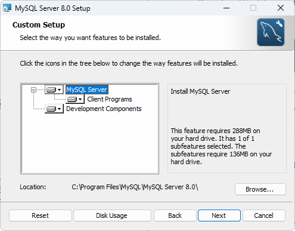

    - 간단하게 설치 완료

- MySQL C API 사용  

#### Viusal C++ 프로젝트 설정

- 생성 후 Visual C++ 프로젝트 속성
    - VC++ 디렉토리 > 일반 > 포함 디렉토리
        - C:\Program Files\MySQL\MySQL Server 8.0\include
    - VC++ 디렉토리 > 일반 > 라이브러리 디렉토리
        - C:\Program Files\MySQL\MySQL Server 8.0\lib

    

    - 링커 > 입력 > 추가종속성
        - libmysql.lib 입력

    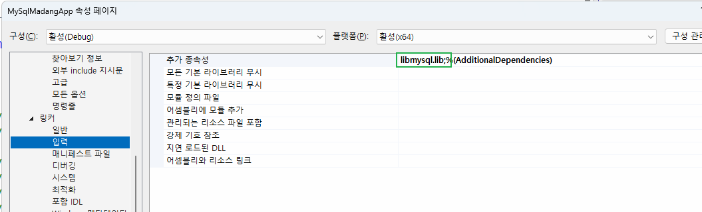

- MySQL 8.0 폴더
    - libmysql.dll 파일 프로젝트로 복사

    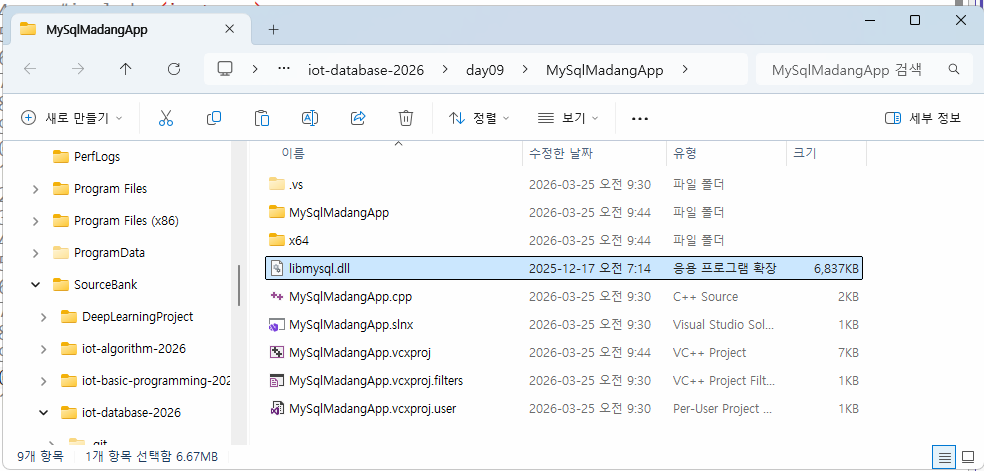

- 시스템 속성 sysdm.cpl
    - 고급 탭 > 환경변수 > 시스템 변수 path
        - C:\Program Files\MySQL\MySQL Server 8.0\bin 추가
    
    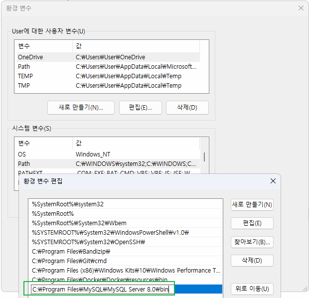

#### C++ MySQL 연동

- 기본 연결확인 구현
- 테이블 데이터 확인
    - 쿼리문 문자열 마지막 ; 무조건 제거(오류발생)

- MySQL 연동 순서 - [소스](./day09/MySQLMadangApp/main.cpp)
    1. 콘솔 인코딩 UTF-8 설정
    2. 연결, 행데이터, 결과 구조체 변수, 포인터 변수 선언
    3. MySQL 초기화
    4. 접속정보로 접속
    5. 서버 문자셋 UTF-8 설정
    6. 쿼리 실행
    7. 결과 메모리 저장
    8. 한 행씩 Fetch, 출력(SELECT에 한함)
    9. 결과 메모리 해제
    10. 접속 종료

#### MySQL CRUD 앱 구현

- Book 테이블 CRUD 테스트 - [소스](./day09/MySqlCrudTest/main.cpp)

- C학습 AddressBook 프로젝트와 비교
    - 텍스트파일 사용, File IO vs MySQL DB
    - contact 구조체 vs MySQL 자체 구조체 사용
    - 파일관련 작업 vs MySQL 함수로 처리

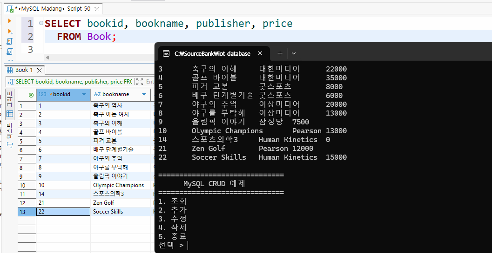

- MySQL C API 함수목록
    - mysql_init() - MySQL DB연결 초기화
    - mysql_real_connect() - 연결 시도
    - mysql_error() - 에러메시지 확인
    - mysql_query() - 쿼리실행
    - mysql_store_result() - 쿼리실행결과 메모리 저장
    - mysql_fetch_row() - 한 행씩 읽어오기
    - mysql_free_result() - 쿼리실행결과 메모리 해제
    - mysql_affected_row() - 쿼리실행 처리 행수 리턴
    - mysql_close() - DB연결 종료

- MySQL Connector/C++
    - MySQL C API를 C++로 클래스화 한 라이브러리
    - 객체화, 예외처리 기능 고급화
    - 운영체제 환경 영향 지대
    - 설정 난이도 높음
    - Visual Studio 설정 까다로움
    - 유지보수 구조적으로는 좋음

- MySQL C API
    - C언어 기반
    - 함수 중심
    - 사용난이도 낮음
    - 설정난이도 낮음
    - 예외처리를 직접 처리